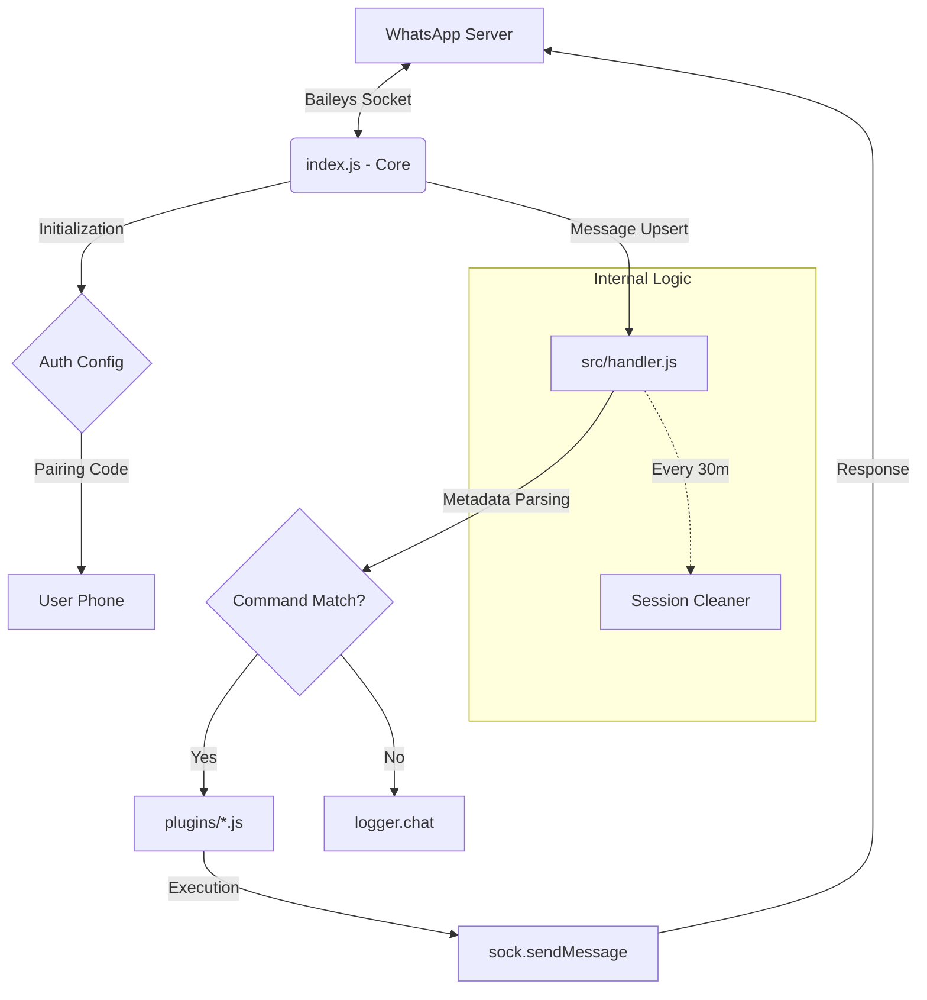

# Biohazard Botz

A powerful and extensible WhatsApp bot built with Baileys (`yemo-dev/yebails`).

## Architecture Schema



## Project Schema

```prisma
// High-level structure of the Biohazard Botz logic

model Plugin {
  name        String   @id
  aliases     String[]
  description String
  ownerOnly   Boolean  @default(false)
  
  // Execution Context
  execute     Function @args(sock, msg, args, metadata)
}

model Config {
  botName       String   @default("Biohazard Botz")
  ownerNumbers  String[]
  prefixes      String[]
  sessionName   String   @unique
  logChats      Boolean  @default(false)
}

model MessageMetadata {
  sender        String
  pushName      String
  isGroup       Boolean
  mimetype      String?
  isQuoted      Boolean
  quotedType    String?
  quotedMimetype String?
}
```

## Internal Flow

1. **Core (`index.js`)**: Manages the connection to WhatsApp via `yemo-dev/yebails`, handles authentication (`auth_info_baileys`), and sets up a global 30-minute session cleanup task.
2. **Handler (`src/handler.js`)**: Intercepts every incoming message, parses advanced metadata (mimetypes, quoted messages, sender info), and checks against the `src/config.js` settings.
3. **Plugins (`plugins/`)**: Modular command files that are dynamically loaded. The handler routes valid commands to these files for execution.
4. **Logger (`src/utils/logger.js`)**: A custom-built logger supporting Windows CMD with specific formatting for system info and user messages.

## Installation

1. **Clone & Install**:

```bash
git clone https://github.com/yemo-dev/biohazard-botz.git
cd biohazard-botz
npm install
```

1. **Configure**: Edit `src/config.js` to set your owner number and prefixes.
2. **Run**: `npm start` and follow the pairing code in your terminal.
