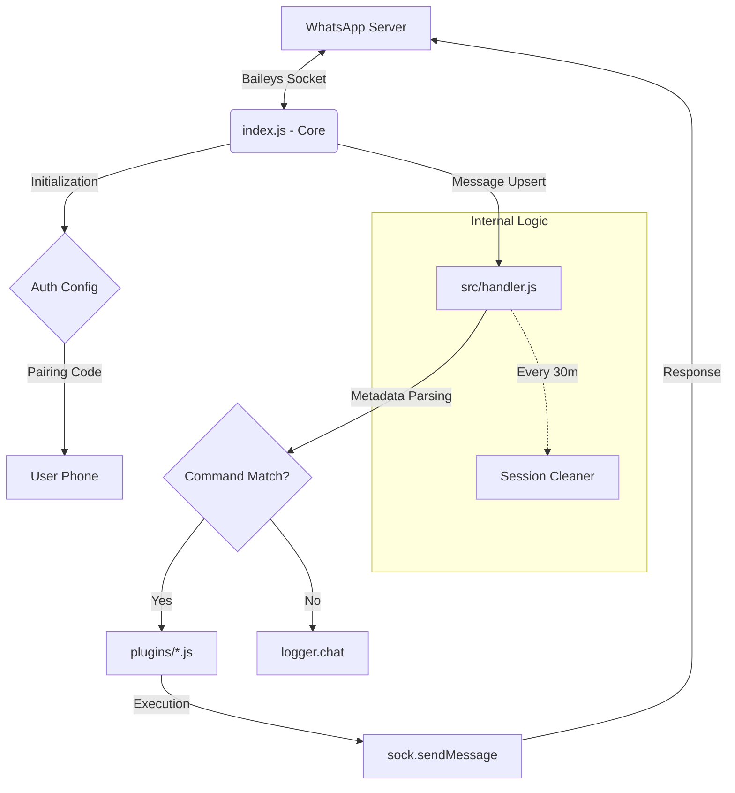

# Biohazard Botz

A powerful and extensible WhatsApp bot built with Baileys (`yemo-dev/yebails`).

## Architecture Schema



## Internal Flow

1. **Core (`index.js`)**: Manages the connection to WhatsApp via `yemo-dev/yebails`, handles authentication (`auth_info_baileys`), and sets up a global 30-minute session cleanup task.
2. **Handler (`src/handler.js`)**: Intercepts every incoming message, parses advanced metadata (mimetypes, quoted messages, sender info), and checks against the `src/config.js` settings.
3. **Plugins (`plugins/`)**: Modular command files that are dynamically loaded. The handler routes valid commands to these files for execution.
4. **Logger (`src/utils/logger.js`)**: A custom-built logger supporting Windows CMD with specific formatting for system info and user messages.

## Installation

1. **Clone & Install**:

    ```bash
    git clone https://github.com/yemo-dev/biohazard-botz.git
    cd biohazard-botz
    npm install
    ```

2. **Configure**: Edit `src/config.js` to set your owner number and prefixes.
3. **Run**: `npm start` and follow the pairing code in your terminal.
