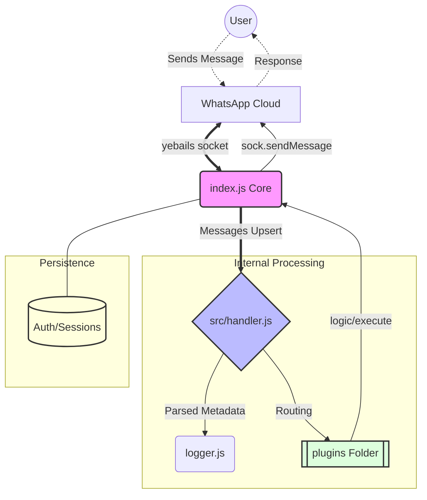

# Biohazard Botz

A powerful and extensible WhatsApp bot built with Baileys (`yemo-dev/yebails`).

## 🏗️ Architecture Schema



## 🚀 Installation & Setup

Follow these steps to get your bot up and running in minutes.

### 1. 📂 Clone & Install

Begin by cloning the repository and installing the necessary dependencies.

```bash
git clone https://github.com/yemo-dev/biohazard-botz.git
cd biohazard-botz
npm install
```

### 2. ⚙️ Configuration

Open `src/config.js` and customize your bot settings:

- **ownerNumbers**: Add your WhatsApp number(s).
- **prefixes**: Define which symbols trigger the bot (e.g., `!`).
- **logChats**: Toggle to `false` to keep your terminal clean.

### 3. 🏁 Run the Bot

Start the application and link it to your WhatsApp account.

```bash
npm start
```

*Wait for the pairing code to appear and enter it in your Linked Devices section.*

## 📂 Project Structure

- **`index.js`**: Core connection and session management.
- **`src/handler.js`**: Advanced message parsing and command routing.
- **`src/config.js`**: Centralized bot settings.
- **`plugins/`**: Modular command directory (Plug & Play).
- **`src/utils/`**: Shared utilities like colors and loggers.
